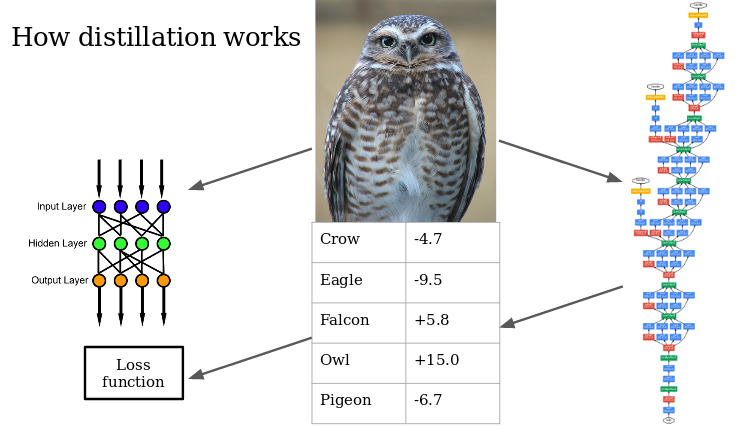

# Distilling Neural Networks

Knowledge distillation is a technique for improving the performance of small lightweight models.  This repository uses distillation to train a small MobileNet image classifier.  

<p float="left">
   
</p>

The diagram above shows a small "student" model on the left learning to imitate the output of the larger teacher model on the right.  The teacher assigns "rich labels" to each training image, which are used instead of the ground truth one-hot image labels.

## Scraping from ImageNet

Using the script Downloader.py, you can scrape ImageNet for images of some desired classes, for example
```
python Downloader.py cat dog bird
```
This will download the images and save them in directories data/train/cat, etc. and data/test/cat, etc.
The default is to download 500 train and 250 test images for each class, but you can change this by editing Downloader.py.  
Many of the ImageNet URLs do not point to valid images, purge any invalid images as follows:
```
python ValidImageTester.py
python CountImages.py
```

## Using your own images

If you'd rather use other images you already have, they need to be stored as follows:
```
data/
  train/
    cat/
      cat00000.jpg
      ...
    dog/
    ...
   test/
    cat/
    dog/
    ...
```
The actual names of the image files are not important, but they must be JPEG files.
If you are using your own images, you can use the script
```
python BuildFolders.py cat dog bird
```
which will create the above directory structure and also other folders for storing convolution features and saving models.
## Testing distillation

You can run an experiment comparing the performance of knowledge distillation on the image classes you downloaded as follows:
```
python Distill.py
```
This will train a DenseNet teacher model by transfer learning, then train a MobileNet student model by distillation.  For comparison, it will also train a MobileNet model without distillation.  The trained models will be saved in the models folder.

If you used the image classes car, dog, and bird in the example code above, you should find that distillation reduces the MobileNet model's classification errors by about 10%.  Feel free to tinker with the numerous hyperparameters in Teacher.py and Student.py, such as numbers of training epochs, distillation temperature and numbers of neurons in the final dense layers.

## Requirements

Keras, tensorflow and numpy and PIL are required.
